# **S A T R I A**
PBL Web Service x MLOps x Data Mining :  

"Pengembangan Eary Warning System berbasis Machine Learning untuk Klasifikasi Kualitas Air serta Mitigasi Risiko pada Biota Akuakultur"

--

"Machine Learning-Based Early Warning System Development for Water Quality Classification to Mitigate Risks among Aquacultural Biotes"
---
---
## **Deskripsi**

---
## **Overview & Alur Kerja**

---
## **Tentang Data**

### **Deskripsi**

- Shape     : 17 cols x 4300 rows
- Theme     : Aquaculture
- Title     : Refined_Aquaculture_Water_Suitability_Signals
- Author    : Sandhya Palaniappan
- Source    : Kaggle
- Date      : March 2026
- Link      : https://www.kaggle.com/datasets/sandhyapalaniappan/refined-aquaculture-water-suitability-signals

### **Preview Data Asli**
| Temperature (°C) | Turbidity (cm) | Dissolved Oxygen (mg/L) | BOD (mg/L) | CO₂ (mg/L) | pH   | Alkalinity (mg/L) | Hardness (mg/L) | Calcium (mg/L) | Ammonia (mg/L) | Nitrite (mg/L) | Phosphorus (mg/L) | H₂S (mg/L) | Plankton (No./L) | Label | Tier                | Description |
|-----------------|---------------:|------------------------:|-----------:|-----------:|-----:|------------------:|----------------:|---------------:|---------------:|---------------:|------------------:|-----------:|------------------:|------:|---------------------|-------------|
| 67.45           |          10.13 |                   0.208 |      7.474 |     10.181 | 4.75 |            218.37 |          300.13 |         337.18 |          0.286 |          4.355 |             0.006 |      0.067 |             6070  |     2 | Reduced Suitability | Water conditions under stress; may impair aquaculture performance. |
| 64.63           |          94.02 |                  11.434 |     10.860 |     14.861 | 3.09 |            273.94 |            8.43 |         363.66 |          0.096 |          2.183 |             0.005 |      0.023 |              251  |     2 | Reduced Suitability | Water conditions under stress; may impair aquaculture performance. |
| 65.12           |          90.65 |                  12.431 |     12.810 |     12.320 | 9.65 |            220.81 |           11.73 |         309.37 |          0.975 |          4.902 |             0.007 |      0.065 |             7219  |     2 | Reduced Suitability | Water conditions under stress; may impair aquaculture performance. |
| 1.64            |           0.07 |                  10.964 |      8.508 |     12.955 | 4.82 |            266.57 |            6.63 |           8.18 |          0.885 |          3.572 |             3.174 |      0.026 |             1230  |     2 | Reduced Suitability | Water conditions under stress; may impair aquaculture performance. |
| 64.86           |           2.12 |                   1.362 |     13.335 |     13.603 |10.24 |            252.11 |          339.89 |         254.00 |          0.802 |          4.656 |             3.855 |      0.061 |             1035  |     2 | Reduced Suitability | Water conditions under stress; may impair aquaculture performance. |
### **Schema dalam Database**

#### **Constraint**
```
ROOT (water_sample)
├── required:
│   ├── physical
│   ├── chemical
│   ├── biological
│   └── water_quality
│
└── nested constraints:
    └── physical:
        └── required:
            ├── temperature
            └── turbidity_cm
```
#### **Kolom Kolom dalam Tabel**
```
water_sample
├── physical                                    (object)
│   ├── temperature                             (double) [required]
│   └── turbidity_cm                            (double) [required]
│
├── chemical                        (object)
│   ├── dissolved_oxygen                        (double)
│   ├── biochemical_oxygen_demand               (double)
│   ├── carbon_dioxide                          (double)
│   ├── ph                                      (double)
│   ├── total_alkalinity                        (double)
│   ├── total_hardness                          (double)
│   ├── calcium                                 (double)
│   ├── ammonia                                 (double)
│   ├── nitrite                                 (double)
│   ├── phosphorus                              (double)
│   └── hydrogen_sulfide                        (double)
│
├── biological                      (object)
│   └── plankton_count                          (double)
│
└── water_quality                   (object)
    ├── water_quality_label                     (int)
    ├── aquaculture_suitability_tier            (string)
    └── aquaculture_suitability_description     (string)
```
---
## **Algoritma & Tools** 

### **Bagan Alur**


### **Algoritma**
- Semi-Supervised : Clustering/Klasifikasi
- **Tools**

- **PyCaret**
Untuk melakukan smoke test mengenai algoritma apakah yang lebih cocok digunakan dalam kasus ini supaya mesin dapat belajar dengan baik.
- **MLFlow**

- **Docker**

---
## **Folder Tree**

``` txt
smart-water-monitoring/
│
├── docker-compose.yml
├── .env
├── README.md
│
├── services/
│   │
│   ├── api-service/
│   │   ├── app/
│   │   │   ├── main.py
│   │   │   ├── routes/
│   │   │   │   ├── predict.py
│   │   │   │   ├── health.py
│   │   │   │   └── water.py
│   │   │   │
│   │   │   ├── schemas/
│   │   │   │   ├── water_schema.py
│   │   │   │   └── prediction_schema.py
│   │   │   │
│   │   │   ├── services/
│   │   │   │   ├── ml_client.py
│   │   │   │   └── data_client.py
│   │   │   │
│   │   │   ├── core/
│   │   │   │   ├── config.py
│   │   │   │   └── security.py
│   │   │   │
│   │   │   └── utils/
│   │   │       └── logger.py
│   │   │
│   │   ├── requirements.txt
│   │   └── Dockerfile
│   │
│   ├── ml-service/
│   │   ├── app/
│   │   │   ├── main.py
│   │   │   ├── preprocess/
│   │   │   │   ├── splitter.py
│   │   │   │   └── filler.py 
│   │   │   ├── model/
│   │   │   │   ├── train.py
│   │   │   │   ├── predict.py
│   │   │   │   └── pipeline.py
│   │   │   │
│   │   │   ├── mlflow/
│   │   │   │   ├── tracking.py
│   │   │   │   └── registry.py
│   │   │   │
│   │   │   └── artifacts/
│   │   │       └── (saved models)
│   │   │
│   │   ├── requirements.txt
│   │   └── Dockerfile
│   │
│   ├── data-service/
│   │   ├── app/
│   │   │   ├── main.py
│   │   │   ├── db/
│   │   │   │   ├── supabase_client.py
│   │   │   │   └── queries.py
│   │   │   │
│   │   │   ├── routes/
│   │   │   │   └── water_data.py
│   │   │   │
│   │   │   └── schemas/
│   │   │       └── water_schema.py
│   │   │
│   │   ├── requirements.txt
│   │   └── Dockerfile
│
├── frontend/
│   ├── public/
│   │   └── index.html
│   │
│   ├── src/
│   │   ├── components/
│   │   │   ├── FormInput.jsx
│   │   │   ├── ResultCard.jsx
│   │   │   └── Navbar.jsx
│   │   │
│   │   ├── pages/
│   │   │   ├── Home.jsx
│   │   │   └── Dashboard.jsx
│   │   │
│   │   ├── services/
│   │   │   └── api.js
│   │   │
│   │   ├── App.jsx
│   │   ├── main.jsx
│   │   └── index.css
│   │
│   ├── tailwind.config.js
│   ├── postcss.config.js
│   ├── package.json
│   └── vite.config.js
│
└── mlflow/
    ├── mlruns/
    └── Dockerfile
```
Proyek SATRIA mengadopsi arsitektur Microservices untuk memisahkan tanggung jawab antar komponen (Separation of Concerns). Setiap layanan berjalan di dalam kontainer terisolasi menggunakan Docker.

### **1. Akar Proyek (Root Directory)**

Bagian ini bertanggung jawab atas orkestrasi seluruh sistem dan konfigurasi global.

- **docker-compose.yml**: Berkas utama untuk menjalankan seluruh layanan dalam satu perintah. Berkas ini mendefinisikan bagaimana setiap kontainer (API, ML, Data, Frontend, MLflow) berinteraksi dan berbagi jaringan.
- **.env**: Menyimpan variabel lingkungan sensitif (seperti kunci API Supabase, kredensial database, atau URL MLflow) agar tidak tertulis langsung di dalam kode program.
- **README.md**: Dokumentasi proyek yang berisi instruksi instalasi, cara menjalankan sistem, dan penjelasan singkat mengenai alur kerja aplikasi.

### **2. Layer Layanan (Services)**

Setiap folder di dalam `services/` adalah aplikasi mandiri yang memiliki `Dockerfile` dan `requirements.txt` sendiri.

#### **A. api-service (The Gateway)**
Bertindak sebagai titik masuk utama bagi permintaan dari Frontend dan pengatur alur data antar layanan.
- **app/main.py**: Titik masuk (*entry point*) aplikasi FastAPI.
- **routes/**: Berisi definisi endpoint API (contoh: `/predict` untuk klasifikasi air, `/health` untuk cek status sistem).
- **schemas/**: Mengatur validasi tipe data yang masuk dan keluar menggunakan Pydantic (contoh: memastikan input sensor adalah tipe numerik).
- **services/**: Berisi logika komunikasi antar layanan (`ml_client.py` untuk menghubungi layanan ML dan `data_client.py` untuk layanan data).
- **core/**: Menyimpan pengaturan inti sistem seperti konfigurasi CORS, keamanan, atau autentikasi.
- **utils/**: Fungsi pembantu umum, seperti sistem pencatatan log (*logging*).

#### **B. ml-service (The Inference Engine)**
Layanan khusus untuk menangani siklus hidup Machine Learning, mulai dari eksperimen hingga prediksi.
- **model/**: Berisi skrip produksi untuk pelatihan model (`train.py`), eksekusi prediksi (`predict.py`), dan alur pemrosesan data (`pipeline.py`).
- **mlflow/**: Berisi logika integrasi dengan server MLflow untuk pelacakan metrik dan manajemen versi model.
- **artifacts/**: Tempat penyimpanan fisik berkas model yang sudah dilatih (seperti berkas `.pkl` atau `.joblib`).

#### **C. data-service (The Data Access Layer)**
Layanan yang bertanggung jawab penuh atas semua komunikasi dan persistensi data ke database.
- **db/**: Berisi koneksi ke Supabase/PostgreSQL dan definisi kueri database yang sering digunakan.
- **routes/**: Menyediakan internal API agar layanan lain bisa mengambil atau menyimpan data tanpa harus mengakses database secara langsung.
- **schemas/**: Memastikan data yang akan dikirim atau disimpan ke database sesuai dengan format yang ditentukan.

### **3. Layer Antarmuka (Frontend)**

Dibangun menggunakan React (Vite) untuk visualisasi monitoring kualitas air.
- **src/components/**: Komponen UI kecil yang bersifat *reusable* (seperti `FormInput.jsx` atau `ResultCard.jsx`).
- **src/pages/**: Struktur halaman utama aplikasi (seperti halaman Beranda dan Dashboard Monitoring).
- **src/services/api.js**: Modul yang menangani komunikasi HTTP dari peramban ke `api-service`.

### **4. Layer Pelacakan (MLflow)**

Layanan mandiri untuk mengelola siklus hidup eksperimen Machine Learning.
- **mlruns/**: Folder tempat MLflow menyimpan log fisik eksperimen (parameter, metrik akurasi, dan file model).
- **Dockerfile**: Konfigurasi khusus untuk menjalankan server UI MLflow di dalam kontainer agar dapat diakses melalui web browser.

Proyek SATRIA mengadopsi arsitektur Microservices untuk memisahkan tanggung jawab antar komponen (Separation of Concerns). Setiap layanan berjalan di dalam kontainer terisolasi menggunakan Docker.

### **1. Akar Proyek (Root Directory)**

Bagian ini bertanggung jawab atas orkestrasi seluruh sistem dan konfigurasi global.

- **docker-compose.yml**: Berkas utama untuk menjalankan seluruh layanan dalam satu perintah. Berkas ini mendefinisikan bagaimana setiap kontainer (API, ML, Data, Frontend, MLflow) berinteraksi dan berbagi jaringan.
- **.env**: Menyimpan variabel lingkungan sensitif (seperti kunci API Supabase, kredensial database, atau URL MLflow) agar tidak tertulis langsung di dalam kode program.
- **README.md**: Dokumentasi proyek yang berisi instruksi instalasi, cara menjalankan sistem, dan penjelasan singkat mengenai alur kerja aplikasi.

### **2. Layer Layanan (Services)**

Setiap folder di dalam `services/` adalah aplikasi mandiri yang memiliki `Dockerfile` dan `requirements.txt` sendiri.

#### **A. api-service (The Gateway)**
Bertindak sebagai titik masuk utama bagi permintaan dari Frontend dan pengatur alur data antar layanan.
- **app/main.py**: Titik masuk (*entry point*) aplikasi FastAPI.
- **routes/**: Berisi definisi endpoint API (contoh: `/predict` untuk klasifikasi air, `/health` untuk cek status sistem).
- **schemas/**: Mengatur validasi tipe data yang masuk dan keluar menggunakan Pydantic (contoh: memastikan input sensor adalah tipe numerik).
- **services/**: Berisi logika komunikasi antar layanan (`ml_client.py` untuk menghubungi layanan ML dan `data_client.py` untuk layanan data).
- **core/**: Menyimpan pengaturan inti sistem seperti konfigurasi CORS, keamanan, atau autentikasi.
- **utils/**: Fungsi pembantu umum, seperti sistem pencatatan log (*logging*).

#### **B. ml-service (The Inference Engine)**
Layanan khusus untuk menangani siklus hidup Machine Learning, mulai dari eksperimen hingga prediksi.
- **model/**: Berisi skrip produksi untuk pelatihan model (`train.py`), eksekusi prediksi (`predict.py`), dan alur pemrosesan data (`pipeline.py`).
- **mlflow/**: Berisi logika integrasi dengan server MLflow untuk pelacakan metrik dan manajemen versi model.
- **artifacts/**: Tempat penyimpanan fisik berkas model yang sudah dilatih (seperti berkas `.pkl` atau `.joblib`).

#### **C. data-service (The Data Access Layer)**
Layanan yang bertanggung jawab penuh atas semua komunikasi dan persistensi data ke database.
- **db/**: Berisi koneksi ke Supabase/PostgreSQL dan definisi kueri database yang sering digunakan.
- **routes/**: Menyediakan internal API agar layanan lain bisa mengambil atau menyimpan data tanpa harus mengakses database secara langsung.
- **schemas/**: Memastikan data yang akan dikirim atau disimpan ke database sesuai dengan format yang ditentukan.

### **3. Layer Antarmuka (Frontend)**

Dibangun menggunakan React (Vite) untuk visualisasi monitoring kualitas air.
- **src/components/**: Komponen UI kecil yang bersifat *reusable* (seperti `FormInput.jsx` atau `ResultCard.jsx`).
- **src/pages/**: Struktur halaman utama aplikasi (seperti halaman Beranda dan Dashboard Monitoring).
- **src/services/api.js**: Modul yang menangani komunikasi HTTP dari peramban ke `api-service`.

### **4. Layer Pelacakan (MLflow)**

Layanan mandiri untuk mengelola siklus hidup eksperimen Machine Learning.
- **mlruns/**: Folder tempat MLflow menyimpan log fisik eksperimen (parameter, metrik akurasi, dan file model).
- **Dockerfile**: Konfigurasi khusus untuk menjalankan server UI MLflow di dalam kontainer agar dapat diakses melalui web browser.


## **How to Access**

### **Windows PowerShell**
``` pwsh
x
```
### **MacOS Bash**
``` bash
x
```
### **Linux Bash**
``` bash
x
```

## **Preview Hasil (Laporan per tanggal ddmmyyyy dari file log.json)**

```json
a
```

### **Tangkapan Layar**
